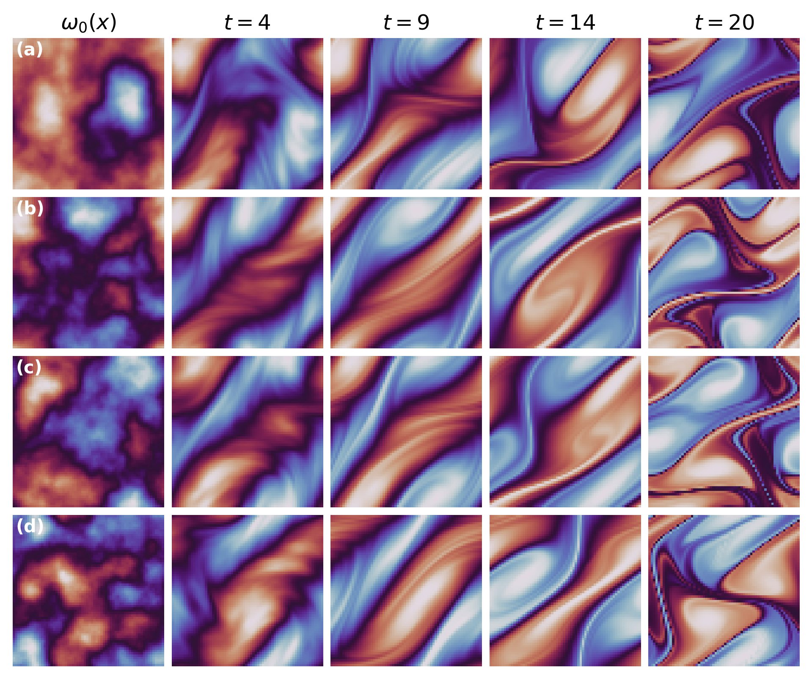

# Turbulent Flows

The unsteady two-dimensional incompressible Navier-Stokes equation for a viscous, incompressible fluid with Kolmogorov forcing in the vorticity form is given by:

$$
\begin{cases}
\partial_t \omega + \mathbf{u} \cdot \nabla \omega = \nu \Delta \omega + f(x, y), & (x, y) \in (0, 2\pi)^2, \, t \in (0, t_{\text{final}}], \\
f(x, y) = \chi \left(\sin(2\pi(x + y)) + \cos(2\pi(x + y))\right), & (x, y) \in (0, 2\pi)^2, \\
\nabla \cdot \mathbf{u} = 0, & (x, y) \in (0, 2\pi)^2, \, t \in (0, t_{\text{final}}], \\
\omega(x, y, 0) = \omega_0, & (x, y) \in (0, 2\pi)^2.
\end{cases}
$$

where $\chi = 0.1$, $\omega$ is the vorticity, $\mathbf{u}$ is the velocity field, $\nu=1\text{e}-6$ is the kinematic viscosity, and $\Delta$ is the two-dimensional Laplacian operator. Initial condition $\omega_0(x) \sim \mathcal{N}\left(0, 14^{1/2}\left(-\Delta + 196 I\right)^{-3/2}\right)$

### Generating Data

The [`data/`](data/) directory contains MLX accelerated code to generate the Kolmogorov flows from Gaussian Random Fields (see [`data/randf.py`](data/randf.py)). Simulating and configuring the dataset is done with [`data/ns2d.py`](data/ns2d.py).

Use the [`plotting.py`](plotting.py) code to visualize samples, such as that below.

  

#### Notice

It is still costly on an Apple M3 Max generate many samples. Thus, existing datasets are still useful for experimentation and comparisons. [ixScience/fourier_neural_operator](https://github.com/ixScience/fourier_neural_operator) provides a good reference to Kolmogorov flows and more that can be downloaded on their [Google Drive](https://drive.google.com/drive/folders/1UnbQh2WWc6knEHbLn-ZaXrKUZhp7pjt-).

### Training

See [`training.py`](training.py) and [`generate.py`](generate.py).
